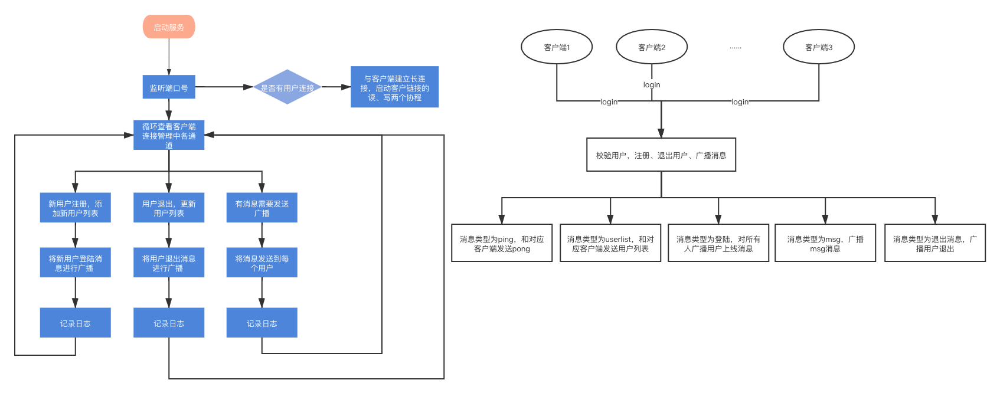

## 1.整体框架

使用gorilla框架进行搭建一个基于websocket协议、protobuf通信数据格式的在线聊天服务。

## 2.目录结构

```
├── app
│   ├── main.go
│   └── ws
│       └── wsServer.go
├── config
│   └── serverLog.log
├── go.mod
├── go.sum
├── internal
│   ├── ctrl
│   │   └── wsController.go
│   ├── handler
│   │   ├── client.go
│   │   └── server.go
│   ├── model
│   │   ├── GeneralReward.pb.go
│   │   └── GeneralReward.proto
│   ├── router
│   │   └── WsRouter.go
│   └── utils
│       ├── LogUtils.go
│       └── WsUtils.go
└── locust
    └── LocustFile.py
```


## 3.代码逻辑分层

| 层        | 文件夹              | 主要职责                             | 调用关系                  | 其他说明         |
| --------- | ------------------- | ------------------------------------ | ------------------------- | ---------------- |
| 应用层    | /app/ws/wsServer.go | 进程启动，server初始化               | 调用路由层                | 不可同层相互调用 |
| 路由层    | /internal/router    | 路由转发，http的path                 | 调用控制层，被应用层调用  | 不可同层相互调用 |
| 控制层    | /internal/ctrl      | 请求参数验证、处理请求后构造回复消息 | 调用handler，被路由层调用 | 不可同层相互调用 |
| handler层 | /internal/handler   | 处理具体业务逻辑                     | 调用模型层，被控制层调用  | 不可同层相互调用 |
| 模型层    | /internal/model     | 数据模型                             | 被业务逻辑层调用          | 不可同层相互调用 |
| 工具层    | /internal/utils     | 工具层                               | 被各层调用                | 不可同层相互调用 |
| 配置层    | /config             | 配置层                               | 放置配置文件和日志        |                  |

## 4.存储设计

传输数据设计

| 内容     | 数据库 | field    | 类型   |
| -------- | ------ | -------- | ------ |
| 消息     | 无     | Msg      | string |
| 类型     | 无     | Type     | int    |
| 用户名   | 无     | Username | string |
| 扩展字段 | 无     | Ext      | string |

客户端信息设计

| 内容           | 数据库 | field    | 类型           |
| -------------- | ------ | -------- | -------------- |
| 用户名         | 无     | Username | string         |
| websocket连接  | 无     | Socket   | websocket.Conn |
| 需要发送的消息 | 无     | Send     | chan []byte    |

客户端管理设计

| 内容           | 数据库 | field      | 类型             |
| -------------- | ------ | ---------- | ---------------- |
| 客户端连接状态 | 无     | Clients    | Map[*Client]bool |
| 发送广播消息   | 无     | Broadcast  | chan []byte      |
| 新建立的长连接 | 无     | Register   | chan []byte      |
| 注销的长连接   | 无     | Unregister | chan []byte      |


## 5.接口设计

### 5.1创建websocket长连接接口 - go实现

#### 接口功能

客户端使用http请求，服务端根据http请求进行升级为websocket的长连接进行消息发送和接收


#### 请求路径

Ws://127.0.0.1:8011/ws

#### 请求参数

| 参数     | 必选 | 类型 | 说明                    |
| -------- | ---- | ---- | ----------------------- |
| username | true | text | requestHead设置username |


## 6.第三方库

### gin

```
用于http服务创建 代码  https://github.com/gin-gonic/gin
```

#### proto

```
用于消息数据协议 代码："github.com/golang/protobuf/proto"
```

#### websocket

```
用于建立socket 长连接 代码："github.com/gorilla/websocket"
```


## 7.如何编译执行

在app文件目录下编译main.go文件后生成可执行文件main，将可执行文件文件放到根目录下进行执行。

在项目执行可执行文件的执行命令

```sh
./main
```


## 8.todo

1.后续的项目结构优化。

## 流程图




